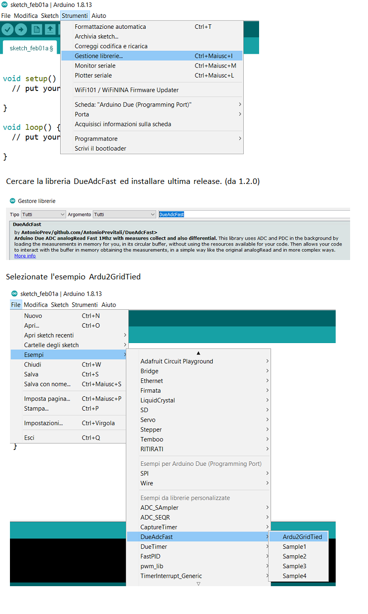

# Ardu2GridTied
Arduino Due grid tied inverter experiens

I am sharing here a proof of feeding energy into the grid.
The documentation has not been translated, for now it is in Italian.

The documentation is in pdf format 
[here.](Leggimi/Leggimi.pdf)

This project is currently at a standstill, but curiosity has prompted me to read up on another form of "inverter" PFC filters.

See the test done with the PC power supply DPS-370AB-1A.
And in particular with IC [ICE1PCS02](Leggimi/My_PFC_test.pdf) 

The Ardu2GridTied code is provided as an example in my library DueAdcFast
Ardu2GridTied use DueAdcFast !

Download the DueAdcFast library from version 1.2 to get the Ardu2GridTied code.
Any future versions of Ardu2GridTied I think will be released here instead. 

To dowload DueAdcFast find in github or follow these visual instructions:

