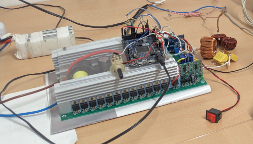

# Ardu2GridTied
Arduino Due grid tied inverter experiens

I am sharing here a proof of feeding energy into the grid.
The documentation has not been translated, for now it is in Italian.

The documentation is in pdf format 
[here.](Leggimi/Leggimi.pdf)

In addition to the documentation, I will shortly make the code available.
